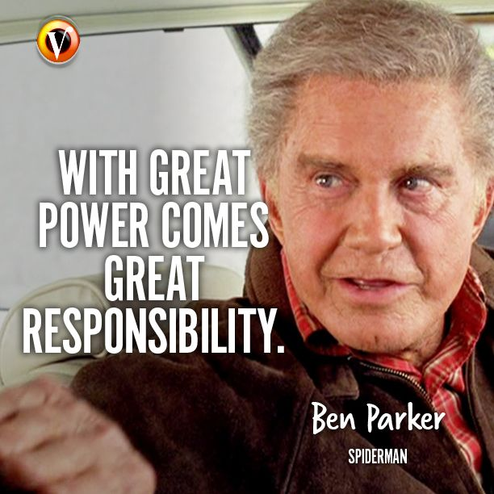

# Encontro de Ninjas - CComp 24/1

## Igor Montagner

---------------

# Roteiro de hoje

- apresentações
- o que é ser ninja?
- situações comuns no dia-a-dia
- encerramento

--------------

# Apresentações

- Nome
- Matéria
- Resumo do plano de trabalho em duas frases

-----

# Algumas expectativas 

----------------

# Algumas expectativas

1. ser respeitoso/a com os alunos e professores do curso
2. dedicar aproximadamente 4 horas por semana
3. ser proativo/a na identificação de tarefas e proposição de soluções
4. comprometer-se com as tarefas assumidas junto aos alunos e professores
5. cuidar do sigilo de aspectos do curso relacionados a avaliação, notas e situações de alunos em geral

----------------

# Impacto no curso!

--------------

-----

# Situações cotidianas

Em pares iremos

- receber uma situação comum 
- escrever como cada um lidaria com ela (1min)
- discutir as ideias em dupla (3 min)
- cada dupla apresenta sua situação e o que discutiu

----------------

# Conflitos

Em pares iremos

- receber uma situação comum 
- escrever como cada um lidaria com ela (1min)
- discutir as ideias em dupla (3 min)
- cada dupla apresenta sua situação e o que discutiu

-------------

# Encerramento
