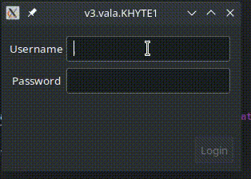

# Vala reactive programming: part 2

In the [last article](2021-12-06.md) we explored how to use properties and bindings to create reactive style programming in Vala. All UI code was written in `construct` and all logic was represented by setting properties. UI was synchronized with the Widget state by binding properties to child widgets. Although the separation of concerns was nice, the example was too simple. There was only one component (the `LoginForm`) and no information was neither (i) sent to other components; or (ii) received from other components. In this article we'll create a second form that receives the validated user from `LoginForm` to a second form.

All the example code for this article is available at the *part2* folder in [this github repo](https://github.com/igordsm/reactive-gtk-vala)



Our component architecture will be based on the following principle:

#### If two components share a parent, then it's the parent's resposability to connect them into a meaningful flow for the application

Let's use this principle to extend the example from the [last article](2021-12-06.md) and add a `UserInfoForm` after a succesful sign in. We'll start from the *part2/v0.vala* file.

## Dealing with events inside a component

Events are a place where UI and logic code seems hard to separate. It's quite natural, for instance, to create a `login_btn_click` event handler that uses both GUI calls to get information from the UI and properties. Fortunately, Vala also provides us with a very nice way of separating this: `lambda` functions as event handlers. 

```c#
private void do_login () {
    // check database and validate login here
    // GUI calls are forbidden here, only properties and other methods can be used
}

construct {
    // ....
    
    login_btn.clicked.connect (() => {
        // extract all info from the UI using GUI calls
        do_login (); 
    });
}
```

In the `lambda` event handler we can extract all info from the UI using GUI calls and then pass this information along to a method. Since we can use bindings to link information between properties and GUI elements, the amount of code inside the `lambda` event handler can be quite small. In fact, it might only treat the event information and pass it on to a method that uses it. Another interesting point is that `lambda` can *ignore* arguments and their types, so if we don't use the `GEvent` that the handler is supposed to receive we can just ignore it in our declaration.

This has two advantages:

1. `do_login` does not receive `Gtk.Event` (or similar), which means it can be called from anywhere in the code, not only in response to an user generated event.
2. Event handlers often receive different arguments depending on which event they handle. The `lambda`handler is used to treat this arguments, so `do_login` is not tied to a single type of event. 

## Sending information out

For sending information out of our components we can use *signals*. For instance, upon succesful login our `LoginForm` could emit a `login_succesful` signal that sends a `User` instance with the currently logged in user info. Now it's up to the parent of `LoginForm` to receive the signal and connect it to the next part of the application flow.

First we modify `LoginForm`. For now our `User` class only contains the `username` property. Also, `username` is can only be assigned when creating an `User` instance.

```c#
class User : Object {
    public string username { get; construct; }

    public User (string username) {
        Object (username: username);
    }
}


class LoginForm : Gtk.Grid {
    public signal void login_succesful (User u);

    // ....

    private void do_login() {
        login_succesful (new User (username));
    }
}
```


Then we receive this information in our `Application` class:

```c#
class Application : Gtk.Application {

	protected override void activate () {
	    var win = new Gtk.ApplicationWindow (this);
        var login_form = new LoginForm ();
        login_form.login_succesful.connect ((u) => {
            print ("%s\n", u.username);
        });
	    win.add (login_form);
        win.show ();
	}

}
```

The complete code is shown in *part2/v1.vala*.

## Intermission: `Application` mixes UI and logic

Our `Application` class is not following the principles outline in the [last article](2021-12-06.md). Let's fix that while we add a new `Gtk.Stack` to hold our new `HelloForm`.

```c#
class HelloForm : Gtk.Grid {
    construct {
        expand = true;
        valign = Gtk.Align.CENTER;
        halign = Gtk.Align.CENTER;

        var label = new Gtk.Label ("Hello (username goes here)");
        attach (label, 0, 0);
    }
}
```

Instead of creating widgets inside `Application` we introduce a `ApplicationWidget`, a class with the sole purpose of creating the workflow of data between our components. Our first version is shown below.

```c#
class ApplicationWidget : Gtk.Stack {
    construct {
        // ...

        var login_form = new LoginForm ();
        add_named (login_form, "login_form");

        var hello_form = new HelloForm ();
        add_named (hello_form, "hello_form");

        visible_child_name = "login_form";
    }
}
```

The complete code is shown in *part2/v2.vala*. Our application works exactly the same as before, but now UI is separated from the rest of the app in `Application` as well.

## Receiving information from other components

For receiving information from the "outside" worlds we have two options: regular instance methods or public properties. The advantage of using instance methods is that they can be directly connected to other components' signals. However, we must take care of only updating properties inside it so we don't mix UI and logic. We can also use public properties to receive data from the "outside world".

* Use methods if something besides updating the UI is necessary (i.e. pulling information from the database or the web) 
* Use properties otherwise 

We add a `user` property to `HelloForm` so it can receive the currently logged in user. We then connect the components in our `ApplicationWidget`:

```c#
class HelloForm : Gtk.Grid {
    public User user { get; set; }

    // ...
}

class ApplicationWidget : Gtk.Stack {
    construct {
        // ...

        login_form.login_succesful.connect ((u) => {
            hello_form.user = u;
            visible_child_name = "hello_form";
        });

    }
}
```
The final part of this is to connect a change in `HelloForm.user` with the UI. A first could be creating a binding between `user.username` to the label text. This won't work, as we are not changing the `username` property of `user`, we are overwritting the whole user object. Our binding must reflect that and listen to changes on the entire `user` object.

Up until this point we only used bindings with the same source and target type. GObject also allows *transformation* bindings, in which we bind properties with different types and provide a function to *transform* on type into the other.

```c#
class HelloForm : Gtk.Grid {
    public User user { get; set; }

    construct {
        // ...

        bind_property ("user", label, "label", BindingFlags.DEFAULT, (binding, srcval, ref targetval) => {
            var user = (User) srcval.get_object ();
            targetval.set_string("Hello, %s!".printf (user.username));
            return true;
        });

    }
}
```

Transformation functions receive [GLib.Value](https://valadoc.org/gobject-2.0/GLib.Value.html), so we need to convert to the type of objects we need. Now our `HelloForm` reacts to a change in the application state in a complex way. And this concludes our experimentation with "reactive" *Vala* and *GTK+*.

I personally like this style of code much more than what I usually read in desktop GUI applications. What do you think? You can send comments [here](https://dev.to/igordsm/vala-reactive-programming-part-2-4pb4).


If you liked this post consider [buying me a coffe](https://www.buymeacoffee.com/igordsm) and/or following me on twitter at [@igor_montagner](https://twitter.com/igor_montagner).


