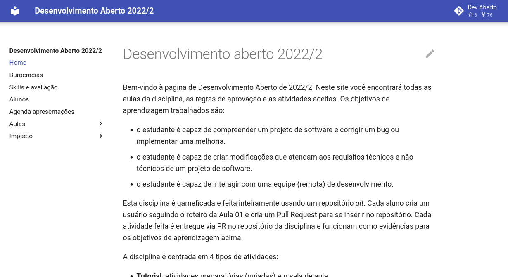
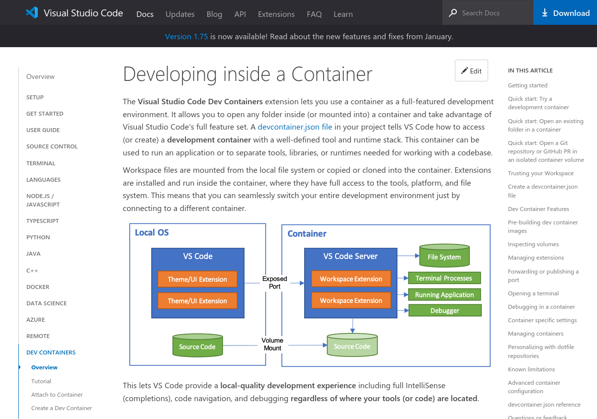
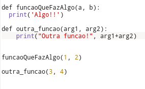
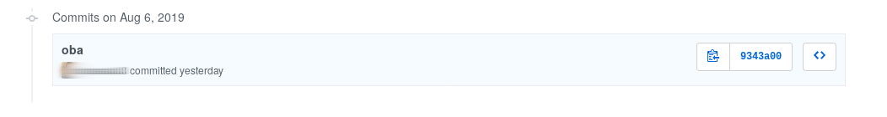
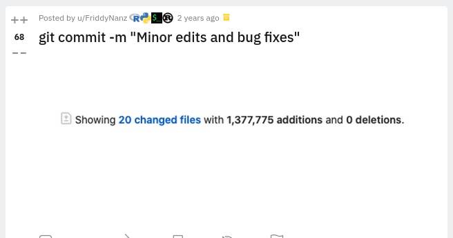
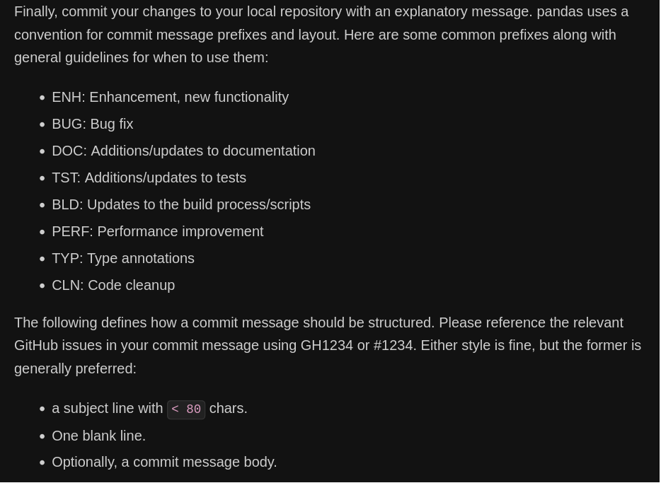

# Licenças de software e boas práticas em Projetos de Software

## PFE 2023/1

### Igor Montagner

-----

# Igor Montagner 

- Experiência em projetos de código aberto
  - elementaryOS 
- Eletiva Desenvolvimento Aberto
  - aprender a contribuir com um projeto que já existe

------

[Material do curso](https://insper.github.io/dev-aberto/)

------

# Licenças

- orientação básicas, não envolvendo particularidades de cada grupo/empresa
- não sou advogado :)

-----

# O que vocês entendem por licença de software?

-----

# Licença de software

Governa os direitos de alguém que **recebe uma cópia do software**. 

- não precisa estar público na internet
- se nunca for distribuído a licençá não importa
- não precisa envolver código fonte 

-----

**Se não tem licença então não pode nada**

-----

# Licenças e autoria

Autoria e permissão para exploração econômica são coisas diferentes.

- "Pela nossa lei de software, a não ser que expressamente dito o contrário, aquele que contrata o desenvolvimento é titular original do software resultante" [1]
- Titular pode controlar distribuição, criação de trabalhos derivados e reprodução/execução

Fontes [1](https://www.startse.com/noticia/mercado/17252/cinco-cuidados-na-contratacao-de-desenvolvimento-de-software)

-----

# Licenças restritivas ou abertas

- **EULA**: protege a empresa titular do sofware, listando atividades que são proibidas (como engenharia reversa ou modificações) e se isentando de responsabilidade por mau uso ou defeitos
- **Abertas**: listam direitos que o usuário do software possui, tentando restringir o mínimo possível. Também se isenta de responsabilidade por mau uso ou defeitos.

---------

# Licenças abertas

- **Permissivas**: código é aberto, mas é possível usá-lo em código fechado desde que seja dada atribuição
- **Virais**: código é aberto e tanto derivações quanto o mero uso tornam o todo aberto nas mesmas condições

-----------

# Recomendação

- Licenças permissivas
  - permitem empresa usar o que vocês produzirem
  - permitem vocês usarem como portfólio
- copyright do projeto seria de vocês (a princípio)

-----

# Licença MIT (slide 1)

Copyright <YEAR> <COPYRIGHT HOLDER>

Permission is hereby granted, free of charge, to any person obtaining a copy of this software and associated documentation files (the “Software”), to deal in the Software without restriction, including without limitation the rights to use, copy, modify, merge, publish, distribute, sublicense, and/or sell copies of the Software, and to permit persons to whom the Software is furnished to do so, subject to the following conditions:

The above copyright notice and this permission notice shall be included in all copies or substantial portions of the Software.

------

# Licença MIT (slide 2)

THE SOFTWARE IS PROVIDED “AS IS”, WITHOUT WARRANTY OF ANY KIND, EXPRESS OR IMPLIED, INCLUDING BUT NOT LIMITED TO THE WARRANTIES OF MERCHANTABILITY, FITNESS FOR A PARTICULAR PURPOSE AND NONINFRINGEMENT. IN NO EVENT SHALL THE AUTHORS OR COPYRIGHT HOLDERS BE LIABLE FOR ANY CLAIM, DAMAGES OR OTHER LIABILITY, WHETHER IN AN ACTION OF CONTRACT, TORT OR OTHERWISE, ARISING FROM, OUT OF OR IN CONNECTION WITH THE SOFTWARE OR THE USE OR OTHER DEALINGS IN THE SOFTWARE.

-----

# Boas práticas em projeto (de software)

---------

# Boas práticas em projeto

- **Visão altruísta**: ter boas práticas ajuda a equipe a trabalhar melhor e a colaborar de maneira eficiente. É exigido pela líderança técnica/gerente de projeto.

---------

# Boas práticas em projeto

- **Visão egocêntrica**: trabalhar em projeto bagunçado é desgastante e piora a qualidade do meu trabalho. 

**Custo de fazer é menor que o ônus de não fazer**

-----

# Boas práticas em projeto

Algumas ideias essenciais:

1. reprodutibilidade
2. previsibilidade
3. "despessoalizar" projeto

----

# Projeto reprodutível

Cada momento que alguém da equipe perde tentando reproduzir o que outros fizeram é precioso

- Ambiente de desenvolvimento 
  - `requirements.txt` e ambientes virtuais (`venv`)
- automatização de execução, deploy, testes
  - docker
  - devcontainer
  - IDEs
- documentação

-----

[https://code.visualstudio.com/docs/devcontainers/containers](https://code.visualstudio.com/docs/devcontainers/containers)

-----

# Projeto "previsível"

-----

# Qualidade de código (Projeto previsível)

- formatação e convenções de código
  - [https://pep8.org/](https://pep8.org/)
  - black, pylint, autopep8
  - suporte a editores de código
- detectar erros e manter código sem erros
  - testes automatizados e CI
  - pytest, github/gitlab actions

---- 

[DEMO PANDAS](https://github.com/pandas-dev/pandas/pull/51542)

----

# "Despessoalizar" projeto

* Permitir que várias (mais de uma) pessoa assumam (quase) todas as partes do projeto

------

# O que foi feito neste commit? (I)

-----

# O que foi feito neste commit? (II)

[https://www.reddit.com/r/ProgrammerHumor/comments/m9etft/git_commit_m_minor_edits_and_bug_fixes/](https://www.reddit.com/r/ProgrammerHumor/comments/m9etft/git_commit_m_minor_edits_and_bug_fixes/)

----

# Convenções de mensagens de commit

- mensagem é uma maneira de comunicar o que mudou para o resto da equipe
- ou para você mesmo no futuro

-----

https://pandas.pydata.org/docs/development/contributing.html

-----

# Convenções de mensagens de commit (mínimo)

1. título da tarefa que foi resolvida
2. pula uma linha
3. descrição breve do que foi mudado e qualquer info relevante para o futuro

----

# Pull Requests

- reúnem uma série de modificações em um só lugar
- "tudo o que precisa para resolver tarefa XX no trello"
- aceitou PR = acabou tarefa

[Voltar para demo pandas](https://github.com/pandas-dev/pandas/pull/51542)

----

# Sugestão de fluxo

1. membro do grupo aceita tarefa no kanban/quadro scrum/trello
2. cria branch para seu trabalho
3. faz vários commits
4. faz PR com modificações, colocando link pra tarefa resolvida no trello
5. outros membros do grupo **leem código** e comentam/tiram dúvidas
6. quando todos estiverem OK faz o merge usando "Squash and Merge"

[Exemplo active-handout](https://github.com/insper-education/active-handout-plugins-py/pull/76), [Exemplo KDE](https://invent.kde.org/utilities/kate/-/merge_requests/1078)

