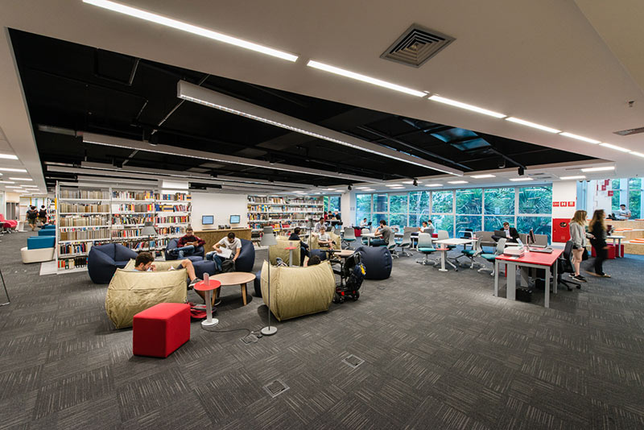
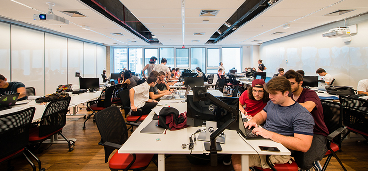
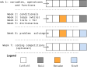
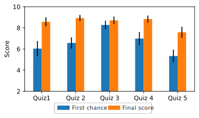

<!-- _class: front -->

# Evaluating Mastery-oriented Grading in an Intensive CS1 Course

## **Igor Montagner**, Rafael Corsi, Andrew Kurauchi, Mariana Silva, Craig Zilles

 

------

# Our context - Insper

- Brazilian private non-profit institution
- Scholarships + stipends for 10-15% of students
- CS major started in 2022
- Cohort-based (*no courses outside of major*)

----------------

# Developer Life - Intensive CS1 course

- 24 hours per week
- 6 two-hour in person meetings
- 5 office hours
- Active learning with occasional mini-lectures and live coding
- Shared between 3-5 professors

------

# DeveloperLife - Intensive CS1 course

### Broad view into many aspects of computing

### Students are able to deliver a working software 

### Every course from the 2nd semester on can involve coding
 
---------

# Developer Life - Assessment

- 5 low stakes formative quizzes $Q_i$ worth 10% of final grade
- 5 high(er) stakes Exams $E_i$ worth 55% of final grade
- Each week a new topic is included

### Exams are spread over the semester to allow student to catch-up if necessary

### Final exam grade is the average of the 3 largest scores

--------

# First experience (challenges)

- **Tendency to increase the gap between the faster and the slower learners**
- For students, catching-up was hard even with 5 exams
  - Double the workload
  - Even higher stakes on the last exam
- Coding-only exams gave us (instructors) little feedback on students weaknesses

-----------

# Mastery Learning and Second-chance testing

### Incorporate a way to help students catch-up into the "regular" course path

**Second-chance testing**: Every assessment includes a retake a few days later and some time dedicated to reviewing mistakes.
 
- Reduce failure rates
- Study for the second-chance remediating material missed on the first one
- Reduces self-reported test anxiety

--------

# Research Questions

- **RQ1**: Do second chances help students to increase their performance over time in intensive courses?
- **RQ2**: Are second chances effective in reducing stress/mental load/weight of assessments in intensive courses?

-----

# Intervention 

Cohort of Fall 2023 had the following changes

1. Add second chances for Quizzes
2. Two types of questions:
	- Short answer - parsons, multiple choice, fill the blank
	- Coding - autograded, involve problem solving, manual code quality evaluation
3. Extra week for reviewing material between Exams 1 and 2

------------

--------

# Methodology

Mixed-methods study, $N=39$ students.

1. Quantitative analysis
	- Quiz and exam grades
	- Coding and short answer
2. Qualitative study
	- Interviewed $10$ students
	- Grounded Theory
	- Prompts about mental state, study habits and test-taking strategies

-----------

 # Second chances on Quizzes

### Improvements in all topics

### Final scores include both first and second attempts

-------------

# Second chances on Quizzes

Students have different test-taking behaviors and gains

- **ALL** ($N=12$): 
	- From failling to passing grades
- **FIRST** ($N=6$):
	- Improved from already good grades (>70%)
- **SKIP** ($N=21$):
	- Almost all skipped $Q5$ (dictionaries)
	- Might be procrastinating/gaming the system
	
----

# Second chances on Exams

- Short answers are satisfactory from the start
- Coding questions start lower and trend upwards with decreasing standard deviation

----------

# Second chances on Exams

- 5 exams, average of the largest 3 scores
	- Exams $E4$ and $E5$ are optional for some
- Taking $E4$ and/or $E5$ benefits students differently
	- $N=5$ went from failling to passing grade
	- $N=16$ improved a passing grade (<75%)
	- $N=14$ improved an excellent grade (>75%)

--------------

## Students are getting better over time

## Encouraging results for the slower learners

## Many students are taking all quizzes/exams even when they don't needed it 

More statistical details in the paper!

----------------

# Interviews analysis

- $N=10$ students with different final grades
- Grounded theory analysis, 2 coding steps
- Three main themes

	1. retake decision making
	2. mental state
	3. study habits

---------

<!-- _class: quote -->
# Retake decision making

Students find grading system confusing and are not sure if they can skip

> (...)  I didn't know how to make the calculation to see if it was worth it for me to retake the exam

Exam is challeging in a good way

> They were coding exercises that involved something quite challenging, you know? And we could do something interesting.

<!--
> (...)  I didn't know how to make the calculation to see if it was worth it for me to retake the exam

> So it's kind of strange not to take the test. Everyone is doing it and I'm not doing anything else. So I wanted to do it
-->

------------

<!-- _class: quote -->
# Mental state 

First chance matters, but retakes help reduce anxiety after exams

> It was good to have this second chance, because it was not discouraging. I think I even knew some cases of friends who didn't do so well at the beginning, but they're doing well now, and they didn't give up. 

### Being rewarded for persistence

-------

<!-- _class: quote -->
# Study habits

Study habits did not change over time. Student display good attitude towards learning

> You must always be studying, always up-to-date with the subject matter because, otherwise, it will accumulate, and the faculty won't always be pushing you to study

-------

# Lessons Learned I

1. Adding second-chance testing had a positive effect on grades
2. Students reported decreased test-related stress
    - but not for the first-chance
3. Good attitude towards learning was observed

---------------

# Lessons Learned II - improvements

### Feedback delay is very relevant when multiple chances exist	

### Grading systems for large (in terms of content) courses

--------------

<!-- _class: front -->

# Evaluating Mastery-oriented Grading in an Intensive CS1 Course

## **Igor Montagner**, Rafael Corsi, Andrew Kurauchi, Mariana Silva, Craig Zilles

 
